# Buchhaltung! – Handbuch für Administratoren

**© 2026 Buchhaltung!. Alle Rechte vorbehalten.**

Dieses Handbuch sowie alle enthaltenen Abbildungen sind urheberrechtlich geschützt. Die Vervielfältigung,
Verbreitung oder Bearbeitung – auch auszugsweise – ist ohne vorherige schriftliche Zustimmung nicht
gestattet, ausgenommen zum internen Gebrauch durch die Administratoren dieser Anwendung.

*Stand: August 2026 · Version 1.1.0*

**Video-Demo:** Ein kurzer Rundgang durch die App (Eintrag erfassen, Jahresübersicht, zweiter
Administrator, Erinnerung, Einstellungen, Download-Seite) liegt unter
[`handbuch/video/buchhaltung-demo.mp4`](video/buchhaltung-demo.mp4).

---

## Inhalt

1. [Einführung](#1-einführung)
2. [Erste Schritte](#2-erste-schritte)
3. [Einnahmen und Ausgaben erfassen](#3-einnahmen-und-ausgaben-erfassen)
4. [Monat abschließen](#4-monat-abschließen)
5. [Jahresübersicht](#5-jahresübersicht)
6. [Die tägliche Erinnerung](#6-die-tägliche-erinnerung)
7. [Einstellungen](#7-einstellungen)
8. [Export & Datensicherung](#8-export--datensicherung)
9. [Mehrere Administratoren](#9-mehrere-administratoren)
10. [Buchhaltung! auf anderen Geräten installieren](#10-buchhaltung-auf-anderen-geräten-installieren)
11. [Häufige Fragen (FAQ)](#11-häufige-fragen-faq)

---

## 1. Einführung

**Buchhaltung!** ist die Desktop- und Web-App zur monatlichen Buchhaltung für bis zu **vier
Administratoren**. Jeder Administrator führt seine eigene, vollständig getrennte Buchhaltung mit zwölf
Monaten (Januar bis Dezember) – unterteilt in **Einnahmen** und **Ausgaben**.

Damit am Monatsende nichts vergessen wird, erinnert die App ab dem **28. jeden Monats täglich um 11:30
Uhr**, solange ein Monat noch nicht als „abgeschlossen“ markiert wurde.

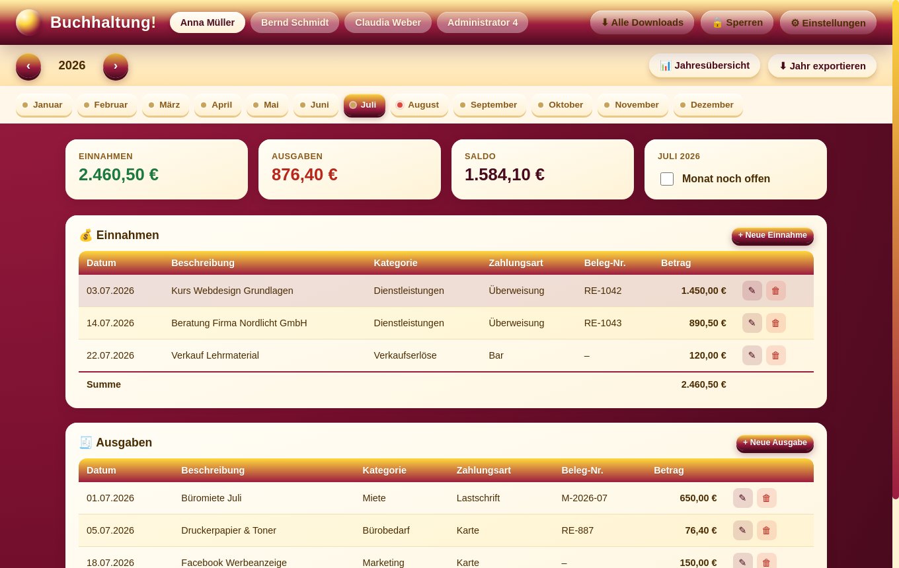
*Die Hauptansicht: oben die Administratoren, darunter Jahr und Monate, in der Mitte die Kennzahlen des
Monats sowie die Tabellen für Einnahmen und Ausgaben.*

---

## 2. Erste Schritte

Beim ersten Start sind bereits **vier Administratoren** angelegt („Administrator 1“ bis „Administrator 4“).
Die Namen lassen sich jederzeit unter **⚙ Einstellungen** anpassen (siehe [Kapitel 7](#7-einstellungen)).

- Oben links im Kopfbereich wählt man per Klick den gewünschten Administrator aus (aktiv = hell hinterlegt).
- Darunter befindet sich die **Jahresleiste**: mit `‹` und `›` zwischen den Jahren wechseln.
- Darunter die **12 Monatsreiter** (Januar–Dezember). Ein farbiger Punkt zeigt den Status:
  - 🟢 **grün** = Monat abgeschlossen
  - 🟠 **orange (blinkend)** = aktueller Monat, ab dem 28. noch offen
  - 🟡 **gelb/beige** = Monat offen, aber noch nicht fällig

---

## 3. Einnahmen und Ausgaben erfassen

Jeder Monat besteht aus zwei Tabellen: **Einnahmen** (💰) und **Ausgaben** (🧾).

1. Auf **„+ Neue Einnahme“** bzw. **„+ Neue Ausgabe“** klicken.
2. Datum, Beschreibung, Kategorie, Zahlungsart, optionale Beleg-Nr. und Betrag eintragen.
3. Mit **„Speichern“** übernehmen.

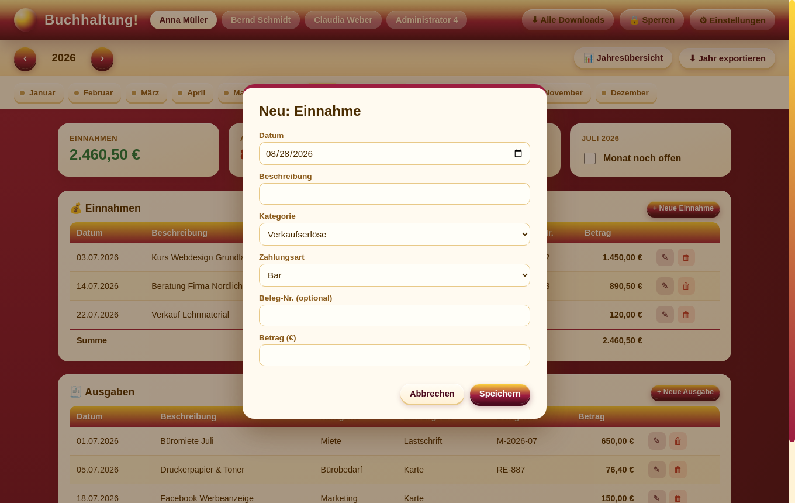
*Eingabemaske für einen neuen Eintrag. Kategorien lassen sich in den Einstellungen erweitern.*

Jeder Eintrag kann über die Symbole ✎ (bearbeiten) und 🗑 (löschen) in der Tabelle nachträglich geändert
werden. Die Löschung muss zur Sicherheit bestätigt werden.

**Tipp:** Belege (Rechnungsnummer, Quittungsnummer) im Feld „Beleg-Nr.“ eintragen – das erleichtert die
spätere Zuordnung zu Papierbelegen oder PDFs bei einer Steuerprüfung.

---

## 4. Monat abschließen

Rechts über den Tabellen zeigt eine Karte den Status des aktuellen Monats („Monat noch offen“ /
„Monat abgeschlossen“). Sobald alle Einnahmen und Ausgaben für den Monat vollständig erfasst sind, die
Checkbox **„Monat abgeschlossen“** aktivieren.

Erst danach:

- wechselt der Punkt im Monatsreiter auf **grün**,
- verschwindet die tägliche Erinnerung für diesen Administrator und Monat.

---

## 5. Jahresübersicht

Der Button **„📊 Jahresübersicht“** zeigt alle 12 Monate des gewählten Jahres mit Einnahmen, Ausgaben,
Saldo und einem visuellen Vergleich nebeneinander – ideal für einen schnellen Rückblick oder die Vorbereitung
der Jahressteuererklärung.

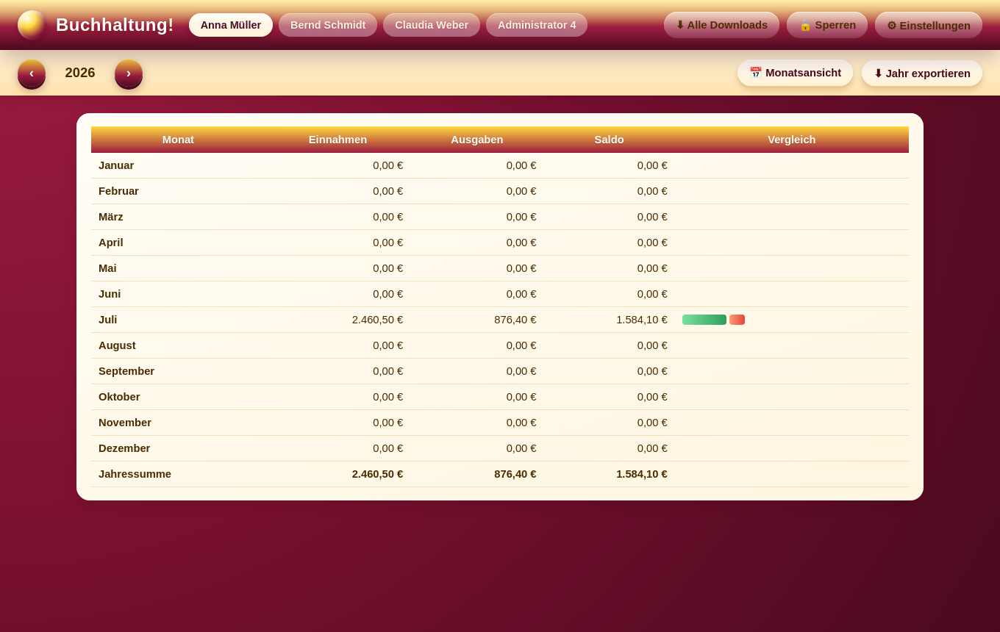
*Jahresübersicht: Summe pro Monat sowie Jahresgesamtsumme in der letzten Zeile.*

Mit **„📅 Monatsansicht“** geht es zurück zur Detailansicht eines einzelnen Monats.

---

## 6. Die tägliche Erinnerung

Ab dem **28. jeden Monats** prüft die App täglich um **11:30 Uhr**, ob alle vier Administratoren ihren
aktuellen Monat abgeschlossen haben. Ist das nicht der Fall, erscheint:

- ein **Hinweisfenster** mit der Liste der betroffenen Administratoren,
- dauerhaft ein **Banner** am unteren Bildschirmrand, solange etwas fehlt,
- zusätzlich eine **Desktop-Benachrichtigung** des Betriebssystems.

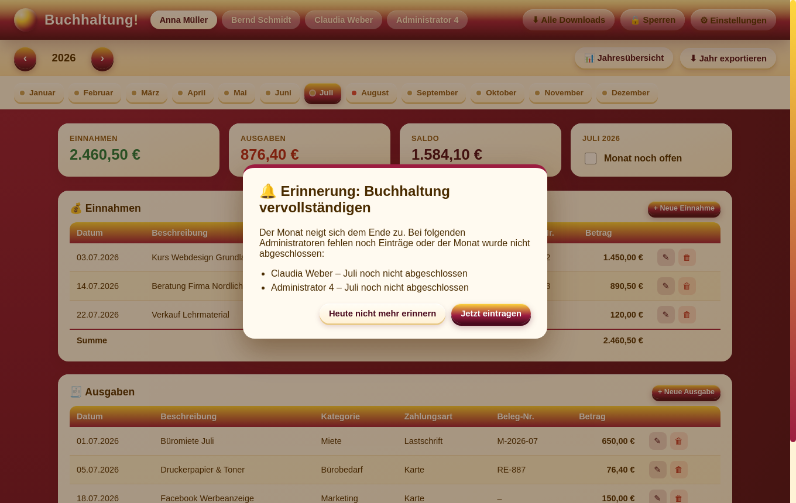
*Das Erinnerungsfenster listet auf, welche Administratoren ihren Monat noch nicht abgeschlossen haben.*

Über **„Jetzt eintragen“** springt man direkt zum betroffenen Administrator und Monat. **„Heute nicht mehr
erinnern“** schließt das Fenster nur für den aktuellen Tag – am nächsten Tag erscheint es erneut, bis der
Monat abgeschlossen ist.

> **Wichtig:** Damit die Erinnerung zuverlässig erscheint, sollte die App im Hintergrund/Infobereich
> (Tray) weiterlaufen und nicht vollständig beendet werden. Siehe dazu auch die Autostart-Option in
> [Kapitel 7](#7-einstellungen).

---

## 7. Einstellungen

Über **⚙ Einstellungen** oben rechts lassen sich verwalten:

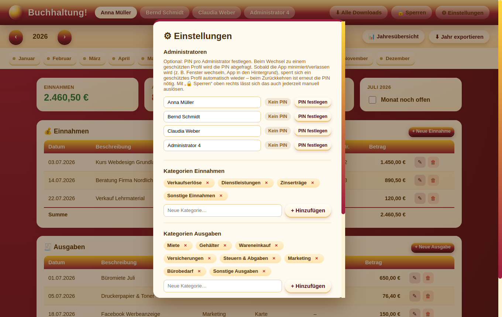

- **Administratoren** – Namen der vier Administratoren ändern, optional eine **PIN** pro Administrator
  festlegen.
- **Kategorien Einnahmen / Ausgaben** – eigene Kategorien hinzufügen oder per „ד entfernen.
- **Erinnerung / Autostart** *(nur Desktop-Version)* – „Beim Systemstart automatisch starten“ aktivieren,
  damit die App zuverlässig im Hintergrund läuft und die Erinnerung nicht verpasst wird.
- **Datensicherung** – vollständige Sicherung exportieren/importieren (siehe nächstes Kapitel).

### PIN-Schutz pro Administrator

Über **„PIN festlegen“** neben einem Administratornamen lässt sich eine 4-stellige PIN vergeben.

*Jeder Administrator zeigt seinen PIN-Status („Kein PIN“ / „PIN aktiv“) mit passendem Button.*

Sobald ein Administrator eine PIN hat, wird sie beim **Wechsel zu diesem Profil** einmal pro
Programmsitzung abgefragt – wer die falsche PIN eingibt, bleibt beim vorherigen Administrator.

*Beim Versuch, zu einem geschützten Profil zu wechseln, erscheint diese Abfrage; erst nach korrekter
Eingabe wechselt die Ansicht tatsächlich zum geschützten Administrator.*

Über „PIN ändern“ lässt sich die PIN jederzeit erneuern oder per „PIN entfernen“ wieder ganz deaktivieren.

**Automatisches Sperren beim Verlassen:** Sobald die App minimiert, in den Hintergrund geschickt oder das
Fenster verlassen wird (z. B. Fenster wechseln, Bildschirm sperren), sperrt sich ein geschütztes Profil
automatisch wieder – beim Zurückkehren ist erneut die PIN nötig. Über den Button **„🔒 Sperren“** oben
rechts (nur sichtbar, wenn der aktuelle Administrator eine PIN hat) lässt sich das auch jederzeit manuell
sofort auslösen, z. B. bevor man kurz den Platz verlässt.

> **Hinweis:** Die PIN schützt vor versehentlichem oder beiläufigem Mitlesen an einem gemeinsam genutzten
> Rechner – sie ist keine Verschlüsselung. Wer direkten Zugriff auf die Datendatei hat, kann sie technisch
> umgehen.

---

## 8. Export & Datensicherung

- **„⬇ Jahr exportieren“** (in der Jahresleiste) erstellt eine **CSV-Datei** mit allen Einnahmen und
  Ausgaben des gewählten Administrators und Jahres – zum Öffnen in Excel/LibreOffice oder zur Weitergabe
  an die Steuerberatung.
- **„⬇ Sicherung exportieren“** (Einstellungen) speichert den **gesamten Datenbestand** (alle
  Administratoren, alle Jahre) als JSON-Datei – empfohlen vor größeren Änderungen oder Systemwechseln.
- **„⬆ Sicherung importieren“** lädt eine zuvor exportierte JSON-Sicherung wieder ein und **ersetzt** den
  aktuellen Datenbestand vollständig.

---

## 9. Mehrere Administratoren

Bis zu vier Administratoren arbeiten unabhängig voneinander – jeder mit eigenen Jahren, Monaten,
Einnahmen/Ausgaben und eigenem Abschluss-Status. Ein Wechsel des Administrators oben in der Kopfzeile
zeigt sofort dessen eigene Buchhaltung.

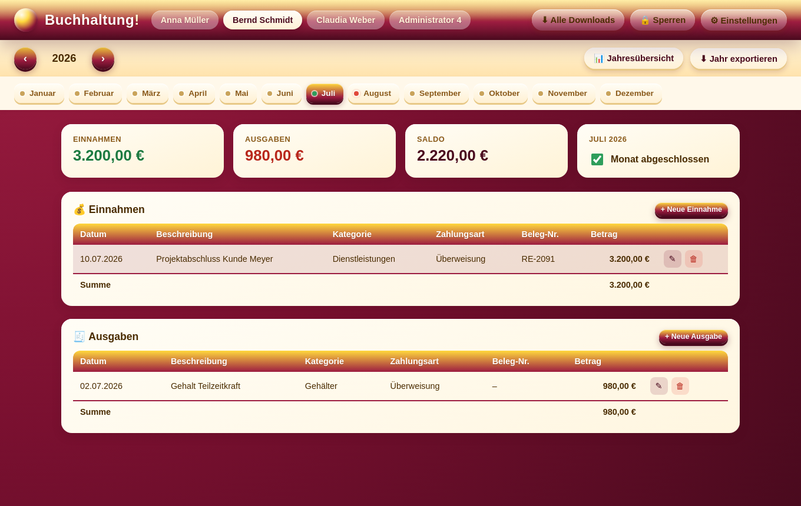
*Zweiter Administrator mit eigenen Einträgen – der Monat Juli wurde hier bereits abgeschlossen.*

---

## 10. Buchhaltung! auf anderen Geräten installieren

| Gerät | Vorgehen |
|---|---|
| **Windows** | Installer (`.exe`) von der Releases-Seite herunterladen und ausführen. |
| **macOS** | `.dmg` herunterladen, öffnen und in den Programme-Ordner ziehen. |
| **Linux** | `.AppImage` herunterladen, ausführbar machen und starten. |
| **Android** | Web-App-Adresse im Browser öffnen → Banner „📲 App installieren“ antippen. |
| **iPhone/iPad** | Web-App-Adresse in Safari öffnen → „Teilen“ → „Zum Home-Bildschirm“. |

Öffnet man die Web-Version am Desktop-Rechner, erkennt die App automatisch das Betriebssystem und zeigt
einen **Ein-Klick-Download-Button** für den passenden Installer an.

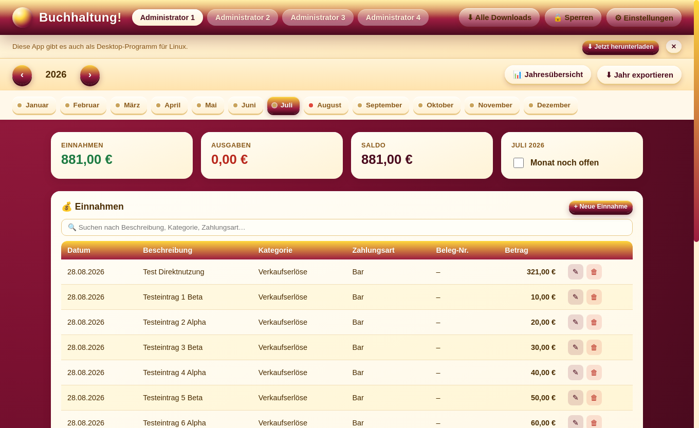
*Die Web-/PWA-Version erkennt das Betriebssystem automatisch (hier: Linux) und bietet den passenden
Download per Klick an – identische Optik wie die Desktop-App.*

### Das Banner auf allen fünf Plattformen

Die folgenden Aufnahmen zeigen das automatisch erkannte Banner, wie es sich für jedes Betriebssystem
unterscheidet (Text und Aktion passen sich jeweils an):

| Windows | macOS |
|---|---|
| 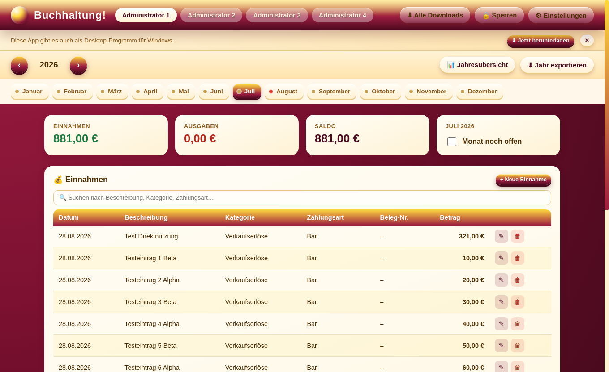 |  |

| Linux | Android | iPhone/iPad |
|---|---|---|
|  | 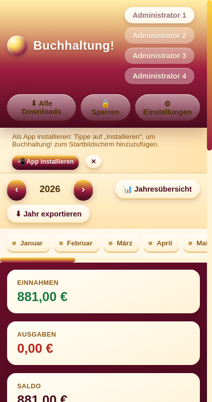 | 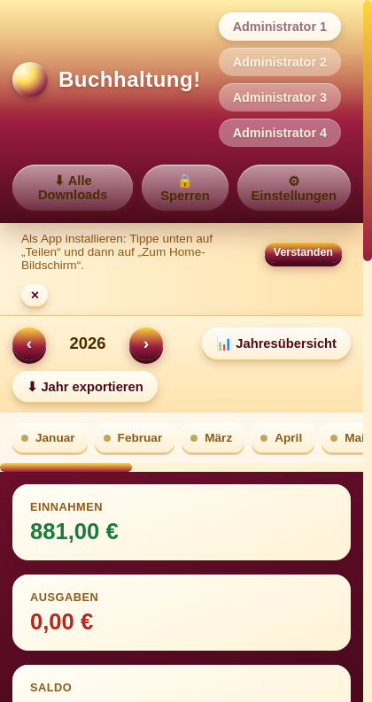 |

- **Windows / macOS / Linux**: Button „⬇ Jetzt herunterladen“ lädt direkt die passende Installationsdatei.
- **Android**: Button „📲 App installieren“ nutzt die native Installations-Aufforderung des Browsers.
- **iPhone/iPad**: Da Safari kein automatisches Installieren per Klick erlaubt, zeigt das Banner die
  Anleitung „Teilen“ → „Zum Home-Bildschirm“.

### Eine Download-Seite für alle Geräte gleichzeitig

Wer den Link nicht nur an ein bestimmtes Gerät, sondern allgemein weitergeben möchte (z. B. per Mail an
das ganze Team), findet unter **`download.html`** eine eigene Übersichtsseite mit **einem Klick-Button für
jede der fünf Plattformen gleichzeitig** – der Empfänger wählt einfach selbst sein Gerät aus. In der
Web-App führt der Header-Button **„⬇ Alle Downloads“** direkt dorthin.

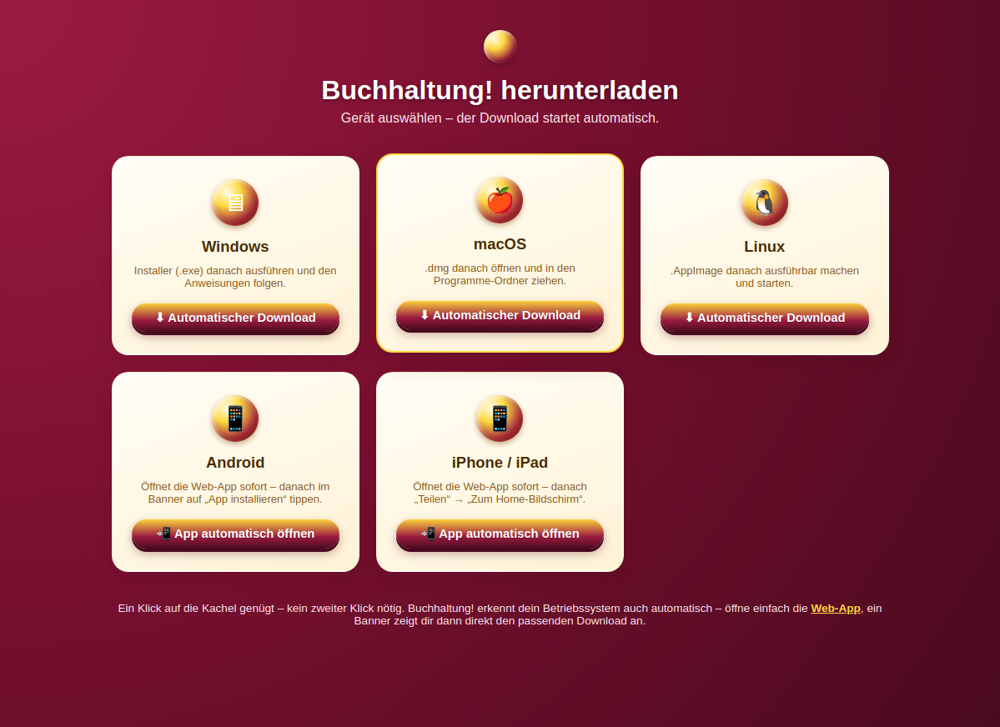
*Eine einzige Seite mit Direkt-Download-Buttons für Windows, macOS, Linux, Android und iPhone/iPad.*

---

## 11. Häufige Fragen (FAQ)

**Was passiert, wenn ich die App über den Infobereich (Tray) schließe?**
Über das „ד am Fenster wird die App nur ausgeblendet, nicht beendet – sie läuft im Hintergrund weiter,
damit die Erinnerung zuverlässig erscheint. Vollständig beenden lässt sie sich über das Tray-Menü
(„Beenden“).

**Ich habe versehentlich einen Eintrag gelöscht – kann ich das rückgängig machen?**
Nein, das Löschen ist endgültig. Regelmäßige Datensicherungen (Kapitel 8) schützen vor Datenverlust.

**Kann ich mehr als vier Administratoren anlegen?**
Nein, die App ist bewusst auf vier Administratoren begrenzt.

**Funktioniert die App auch offline?**
Ja. Sowohl die Desktop-App als auch die installierte Web-App (PWA) speichern alle Daten lokal und
benötigen keine Internetverbindung im laufenden Betrieb.

---

*Buchhaltung! – © 2026. Alle Rechte vorbehalten. Dieses Handbuch dient ausschließlich der internen
Einweisung der Administratoren und darf nicht ohne Zustimmung weitergegeben werden.*
