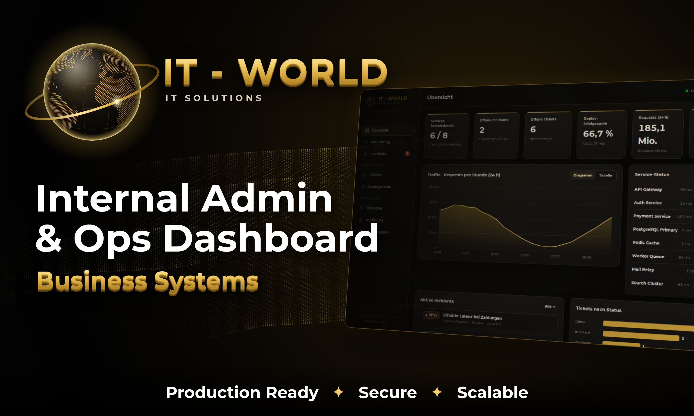

# IT - World · Internal Admin & Ops Dashboard

**Production Ready · Secure · Scalable** – ein internes Admin- und Betriebs-Dashboard im Schwarz/Gold-Design mit rotierendem 3D-Globus-Logo.
Node.js/Express-Backend mit REST-API, Login, Rollenrechten und Audit-Log; Oberfläche ohne Framework (Vanilla JS, responsive für Desktop, Tablet und Handy).



## Seiten (8)

| Seite | Inhalt | Rollen |
|---|---|---|
| **Übersicht** | KPIs, Traffic-Diagramm 24 h (auch als Tabelle), Service-Status, aktive Incidents, Tickets nach Status, letzte Deployments | alle |
| **Monitoring** | Service-Kacheln mit CPU/RAM/Latenz, Detail-Diagramm (CPU, RAM, Latenz, Requests/s, Fehlerrate · 1 h/24 h), Status setzen, Neustart, Service anlegen/entfernen | alle · Aktionen ab Ops |
| **Incidents** | SEV1–SEV4, Status-Workflow (Offen → Analyse → Beobachtung → Gelöst), Verlauf mit Updates | alle · Bearbeiten ab Ops |
| **Tickets** | Suche, Filter (Status, Priorität, „Nur meine“), Zuweisung, Kommentare | alle · Bearbeiten ab Ops |
| **Deployments** | Staging/Produktion, simulierte Pipeline, Rollback | alle · Starten ab Ops |
| **Benutzer** | Anlegen, Rolle ändern, deaktivieren, Passwort zurücksetzen, löschen | Admin |
| **Audit-Log** | Jede Aktion mit Benutzer, Ziel und IP; Suche, Filter, Seiten | Admin |
| **Einstellungen** | Firmenname, Alarm-E-Mail, Session-Timeout, SLA-Ziel, Aktualisierungsintervall, Wartungsmodus, eigenes Profil | Ändern: Admin |

CSV-Export (Excel-kompatibel, mit Schutz vor CSV-Injection) für Tickets, Incidents, Deployments, Benutzer und Audit-Log.

## Schnellstart

```bash
cd it-world
npm install
npm start            # http://localhost:8080
```

Im Entwicklungsmodus (Standard) wird mit Demo-Daten gestartet; die Login-Seite zeigt die Demo-Zugänge:

| Rolle | E-Mail | Passwort |
|---|---|---|
| Administrator | admin@it-world.local | ItWorld-Admin-2026 |
| Operations | ops@it-world.local | ItWorld-Ops-2026 |
| Nur Lesen | viewer@it-world.local | ItWorld-View-2026 |

`npm run reset-data` löscht die Datendatei; beim nächsten Start wird neu angelegt.

## Produktion

```bash
NODE_ENV=production ADMIN_EMAIL=chef@firma.de ADMIN_PASSWORD='SicheresPasswort123' npm start
# oder
docker compose up -d --build
```

Im Produktionsmodus gibt es **keine Demo-Konten**: Es wird genau ein Administrator angelegt (Passwort aus `ADMIN_PASSWORD`, sonst zufällig erzeugt und einmalig im Log ausgegeben), der beim ersten Login zum Passwortwechsel aufgefordert wird.

| Variable | Standard | Bedeutung |
|---|---|---|
| `PORT` / `HOST` | `8080` / `0.0.0.0` | Adresse des HTTP-Servers |
| `NODE_ENV` | – | `production` aktiviert HSTS, sichere Cookies, kein Demo-Modus |
| `DATA_FILE` | `data/it-world-data.json` | Speicherort der Daten |
| `DEMO_MODE` | `true` außer in Produktion | Demo-Daten und Demo-Zugänge |
| `ADMIN_EMAIL` / `ADMIN_PASSWORD` | `admin@it-world.local` / zufällig | Erster Administrator (nur ohne Demo-Modus) |
| `COOKIE_SECURE` | `true` in Produktion | Cookie nur über HTTPS (`__Host-`-Präfix) |
| `TRUST_PROXY` | – | `true` hinter nginx/Traefik, damit IPs im Audit-Log stimmen |
| `DEPLOY_FAILURE_RATE` | `0.1` | Anteil fehlschlagender Deployments in der Pipeline-Simulation (0–1) |

`GET /healthz` liefert den Status für Load-Balancer, Docker und Kubernetes.

## Sicherheit

- Passwörter mit **scrypt** + zufälligem Salt, Vergleich in konstanter Zeit; Passwortrichtlinie (≥ 10 Zeichen, Buchstaben + Ziffern)
- Session-Token mit 256 Bit, **HttpOnly + SameSite=Strict**, gleitender Ablauf; Passwortwechsel und Deaktivierung beenden alle Sitzungen
- **CSRF-Schutz**: eigener Request-Header + Origin-Prüfung für alle schreibenden Anfragen
- **Rate-Limiting**: Login pro IP und pro Konto, allgemeines API-Limit
- **Content-Security-Policy** ohne `unsafe-inline`, `X-Frame-Options: DENY`, `nosniff`, `Referrer-Policy`, HSTS
- **RBAC** wird ausschließlich serverseitig geprüft; der letzte Administrator kann nicht entfernt werden
- Oberfläche setzt Nutzerdaten nur über `textContent` (kein `innerHTML`) → kein XSS
- Atomare Speicherung (tmp-Datei + rename, Dateirechte 600), beschädigte Dateien werden gesichert statt überschrieben

## Architektur

```
it-world/
├── server.js            Express-Server, REST-API, Rechteprüfung
├── lib/
│   ├── security.js      scrypt, Sessions, Rate-Limiter, Security-Header
│   ├── store.js         JSON-Datenablage, Migration, Demo-/Initialdaten
│   └── metrics.js       Simulierte Live-Metriken (austauschbar gegen Prometheus o. Ä.)
├── public/              Oberfläche (login.html/js, index.html, app.js, globe.js, style.css, assets/)
├── tools/
│   ├── gen-globe.mjs    erzeugt Landpunkte + Logo/Favicon aus world-atlas
│   ├── render-marketing.mjs  rendert Fiverr-Grafiken (Playwright)
│   └── reset-data.js
├── marketing/           Vorlagen + fertige PNGs (output/)
├── Dockerfile, docker-compose.yml
```

**Skalierung:** Datenablage (`lib/store.js`), Sessions (`SessionStore`) und Metriken (`lib/metrics.js`) sind hinter kleinen Schnittstellen gekapselt. Für mehrere Instanzen hinter einem Load-Balancer werden sie gegen PostgreSQL, Redis und einen Monitoring-Adapter getauscht – die API und die Oberfläche bleiben unverändert.

## Marketing-Grafiken (Fiverr)

Fertig in `marketing/output/`:

- `fiverr-thumbnail.png` – Gig-Titelbild (1280×769, @2x)
- `fiverr-gallery-features.png` – „8 Seiten“ mit Screenshots
- `fiverr-gallery-security.png` – Sicherheits-Features + Handy-Ansicht
- `it-world-logo.png` – 3D-Goldglobus mit Schriftzug „IT - WORLD“ (1024×1024, @2x)
- `it-world-anleitung.mp4` – Anleitungsvideo (ca. 7 Min., 1280×720, deutsche Untertitel, sichtbarer Mauszeiger) + `it-world-anleitung-kapitel.txt` mit Zeitmarken

Neu erzeugen: `npm i -D playwright && npx playwright install chromium && npm run gen:marketing`.
Anleitungsvideo neu aufnehmen (braucht zusätzlich ffmpeg im PATH oder `FFMPEG_PATH`): `npm run record:tutorial`.
Logo/Globus neu erzeugen: `npm run gen:globe`.

## Lizenzen

Montserrat-Schrift: SIL Open Font License (`public/assets/fonts/OFL-LICENSE-Montserrat.txt`). Kartendaten: Natural Earth über `world-atlas` (Public Domain).
